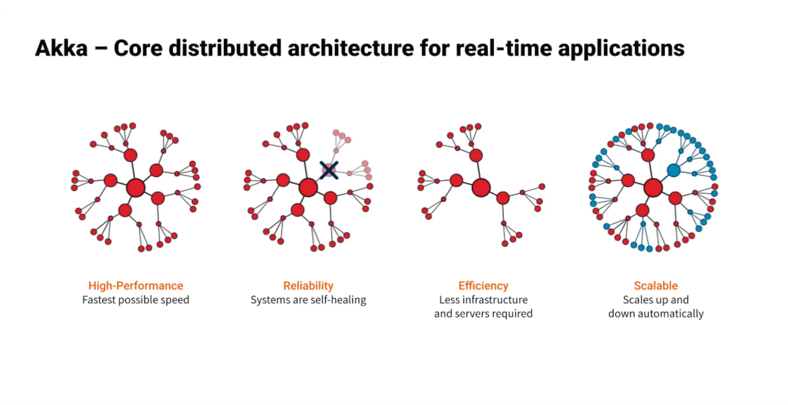
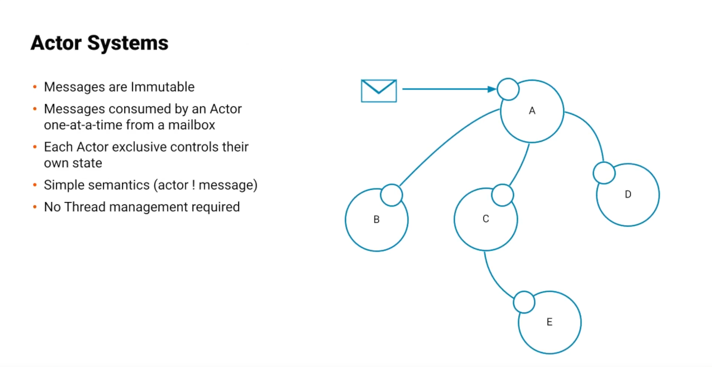
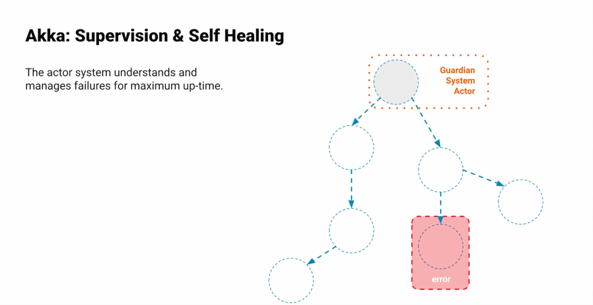
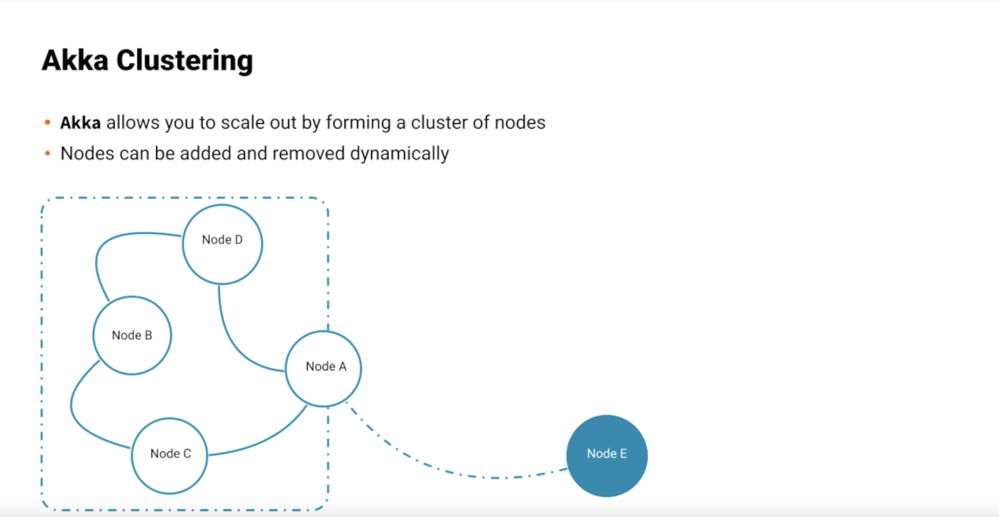

Note:
Akka is a toolkit for building highly concurrent, distributed, and resilient message-driven applications for Java and Scala. It is designed to make it easier to build systems that are able to handle high levels of concurrency, handle failures and scala horizontally accross multiple machines.

---

Note:
Akka is based on the actor model, which is a concurrency model that emphasizes the use of small, independant units of computation called actors. Actors can send messages to each other and they can also create new actors and send messages to them. This allows developers to build distributed systems that are easy to reason about and maintain.

---

Note:
Akka includes a wide range of features and tools for building distributed systems, including actor hierarchies, message routing,

---

Note:
cluster support and distributed data.

---

Note:
It is widely used in the development of high concurrency systems such as web servers, real-time data processing pipelines and distributed databases.